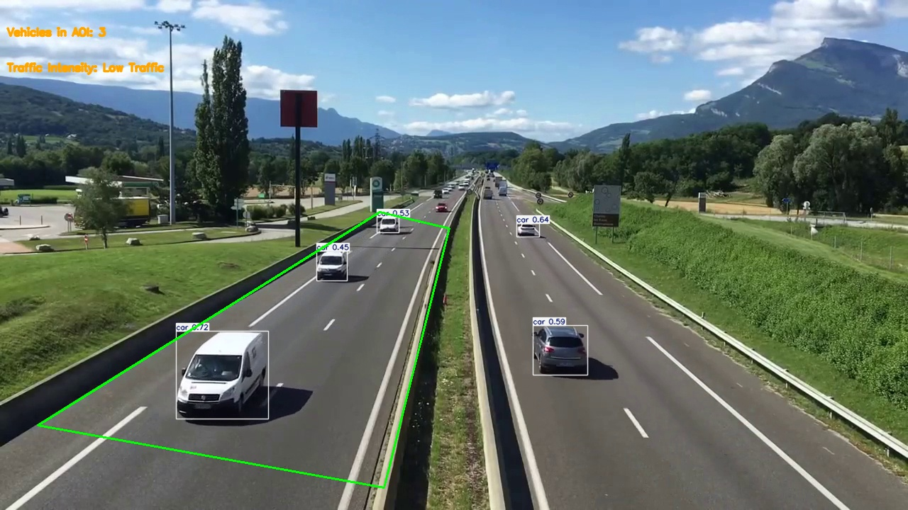
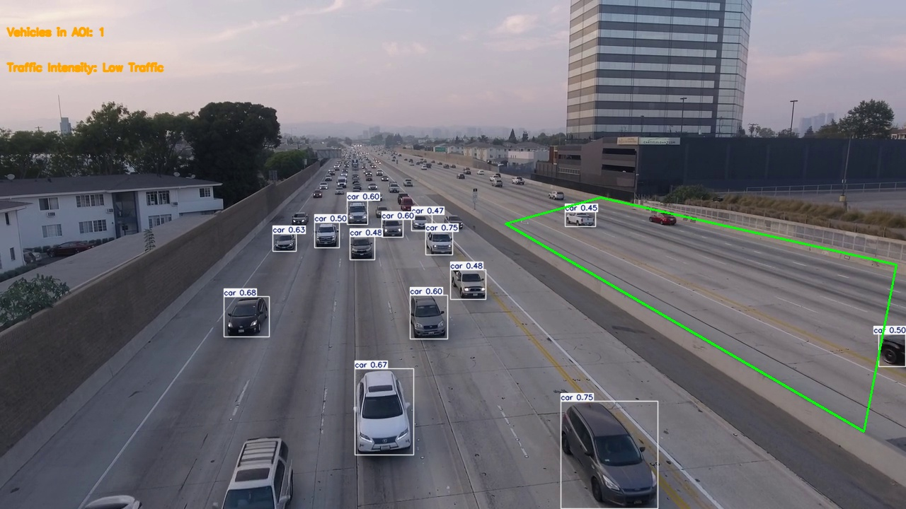
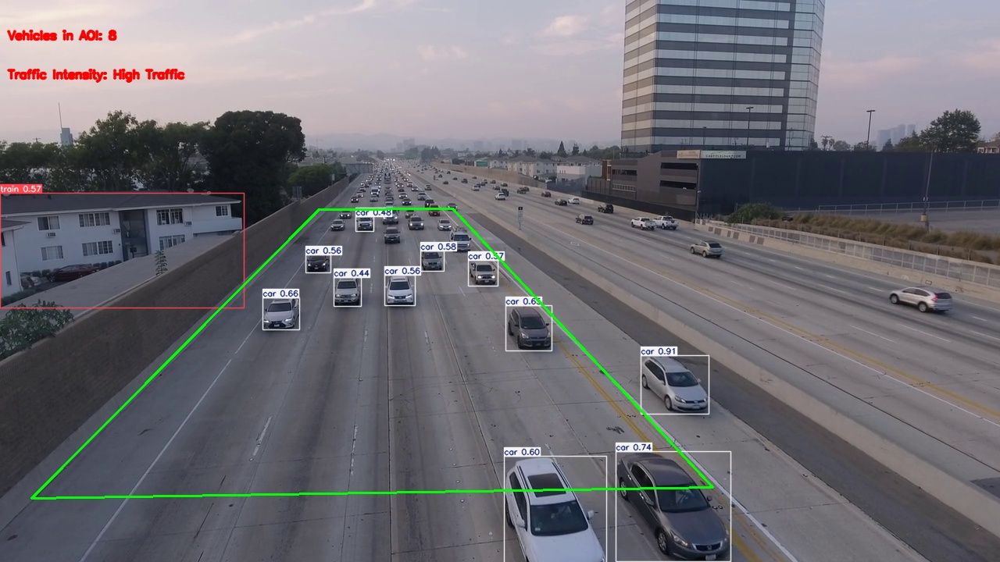
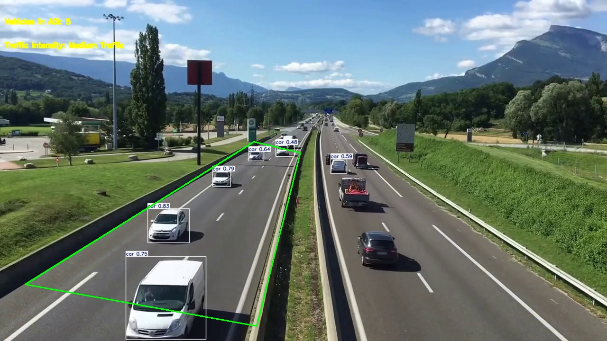
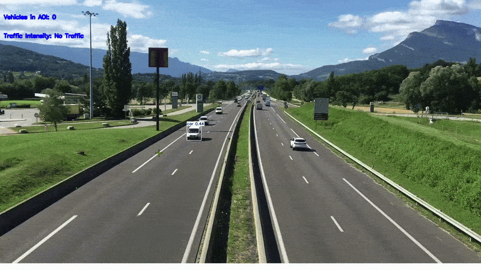

# Traffic Analysis Using YOLOv11

## Overview
This project implements a real-time traffic analysis system using the YOLOv11 object detection model. It processes video frames to detect vehicles, evaluates traffic intensity, and logs the results. The system allows users to define an Area of Interest (AOI) for vehicle counting and provides metrics for performance evaluation.

## Features
- **Load Pre-trained Model**: Utilizes a YOLOv11 model (`yolo11n.pt`) for vehicle detection.
- **Traffic Intensity Classification**: Classifies traffic intensity into four categories:
  - No Traffic
    
  - Low Traffic
    
  - Medium Traffic
    
  - High Traffic
    
- **Area of Interest (AOI) Definition**: Users can define a polygonal AOI using mouse events to focus on specific areas in the video.
  
- **Real-time Processing**: Processes video frames in real-time, displaying detected vehicles and traffic intensity.
  
- **Ground Truth Logging**: Saves ground truth data for each frame in JSON format.
  
- **Excel Logging**: Saves traffic analysis data to an Excel file for further analysis.
## These are  some Frame level results extracted from the Processed frames folder







## How To Draw AOI of Your Choice?
## note-drawing own AOI is possible only on one_way_draw.ipnb

## Requirements
-opencv-python 

-numpy

-ultralytics

-pandas

-scikit-learn

# news
Eventhough we focus on implemeting the project using yolo v11 there are 3 model including v8n and v5n.
# Usage

## There are 2 files:

- **one_way_draw**
- **two_way_static**

Both files aim to find traffic density, but each uses different environmental conditions.

- **one_way_draw** is designed for traffic analysis in one direction only, not for two-way or multi-lane scenarios.
- **two_way_static** utilizes a predefined Area of Interest (AOI) for traffic estimation, and users cannot change the AOI on their own, unlike in **one_way_draw**.

## Instructions

To use the files, simply run the `one_way_draw.ipynb` or `two_way_static.ipynb` file in Jupyter Notebook or any IDE.

- If you are using Jupyter Notebook, download the entire folder to your `ThisPC -> Users` directory. That's all you need to do.
- If you are using IDEs such as VSCode, download the file and open the `.ipynb` file. Copy and paste the entire content into a new `.py` file, and then run the following command in the IDE terminal or command prompt:

    ```bash
    python yourappname.py
    ```

Thank you for your time, and have a great day!
